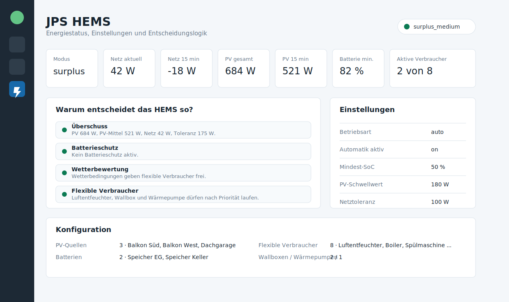

# BB HEMS

Modular Home Energy Management System for Home Assistant.

BB HEMS turns existing Home Assistant sensors and switches into one central energy decision layer. It is designed for homes with balcony power plants, PV inverters, batteries, wallboxes, heat pumps and flexible consumers such as dehumidifiers, boilers or appliances.



## Goals

- Use existing Home Assistant sensors.
- Aggregate multiple PV or balcony power plant sources.
- Support several batteries and protect the lowest SoC.
- Keep HEMS decisions central instead of repeating YAML per device.
- Expose thresholds and operating mode as Home Assistant entities.
- Add a sidebar dashboard explaining the current decision.
- Prepare for flexible loads, wallboxes, heat pumps and future device categories.

## System Model


BB HEMS has three layers: sources, controller and consumers. Sources provide grid, PV, battery, weather and device state data. The controller calculates energy mode, surplus, battery protection and flexible-load approval. Consumers use those central decisions.

## Configuration Mockup


Suggested mapping from the original automation:

| HEMS Field | Home Assistant Entity |
|---|---|
| Grid power | `sensor.power_shelly_gesamt` |
| Grid average | `sensor.grid_average_15m` |
| PV power sources | `sensor.shellyplusplugs_b0b21c105338_switch_0_power` |
| PV average | `sensor.pv_average_15m` |
| Battery SoC | `sensor.batterie_geschatzt_soc` |
| Battery discharge | `sensor.batterie_discharge` |
| Weather state | `sensor.berlin_tempelhof_wetterzustand` |
| Cloud coverage | `sensor.berlin_tempelhof_bewolkungsgrad` |
| Sunshine duration | `sensor.berlin_tempelhof_sonnenscheindauer` |
| Flexible loads | `switch.a8m` |

## Main Entities

- `sensor.bb_hems_energy_mode`
- `sensor.bb_hems_grid_power`
- `sensor.bb_hems_grid_average`
- `sensor.bb_hems_pv_power_total`
- `sensor.bb_hems_pv_average`
- `sensor.bb_hems_battery_soc_min`
- `sensor.bb_hems_battery_discharge_total`
- `binary_sensor.bb_hems_surplus_available`
- `binary_sensor.bb_hems_battery_protect`
- `binary_sensor.bb_hems_good_weather`
- `binary_sensor.bb_hems_flexible_loads_allowed`
- `select.bb_hems_mode`
- `switch.bb_hems_auto_enabled`

## Installation

Copy this folder into Home Assistant:

```text
custom_components/bb_hems
```

Restart Home Assistant, then add the integration:

```text
Settings -> Devices & services -> Add integration -> BB HEMS
```

## Example Automation

```yaml
alias: HEMS Luftentfeuchter
triggers:
  - trigger: state
    entity_id: binary_sensor.bb_hems_flexible_loads_allowed
    to: "on"
    for:
      minutes: 10
  - trigger: state
    entity_id: binary_sensor.bb_hems_flexible_loads_allowed
    to: "off"
    for:
      minutes: 5
actions:
  - choose:
      - conditions:
          - condition: state
            entity_id: binary_sensor.bb_hems_flexible_loads_allowed
            state: "on"
        sequence:
          - action: switch.turn_on
            target:
              entity_id: switch.a8m
      - conditions:
          - condition: state
            entity_id: binary_sensor.bb_hems_flexible_loads_allowed
            state: "off"
        sequence:
          - action: switch.turn_off
            target:
              entity_id: switch.a8m
mode: single
```

## Roadmap

- Per-device registry with priority, category, runtime and cooldown.
- Priority scheduler for many flexible loads.
- Wallbox strategy with charge-current control.
- Heat-pump strategy with comfort bands and thermal buffer support.
- Device-level history explaining why a device was allowed, blocked, started or stopped.
- Forecast-aware planning for PV windows.
