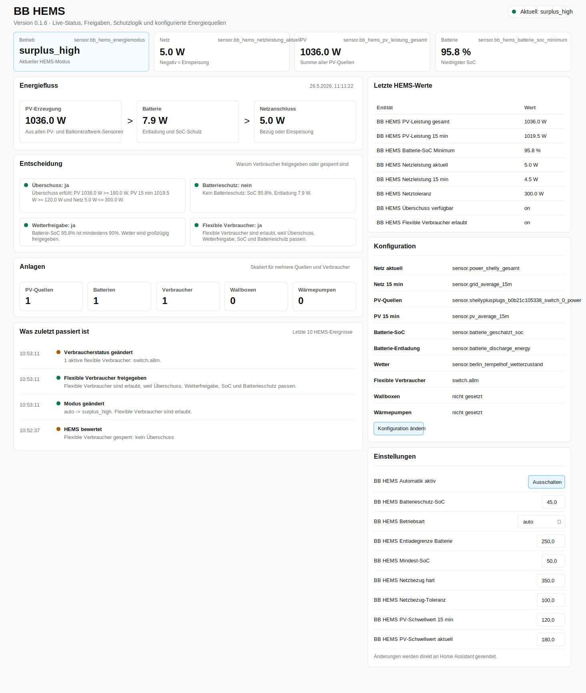
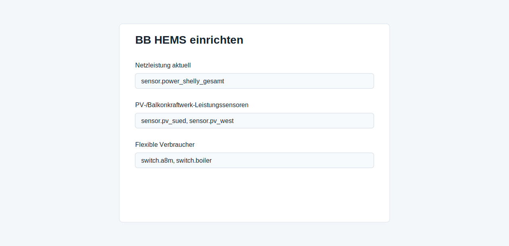

# BB HEMS

Modular Home Energy Management System for Home Assistant.

BB HEMS turns existing Home Assistant sensors and switches into one central energy decision layer. It is designed for homes with balcony power plants, PV inverters, batteries, wallboxes, heat pumps and flexible consumers such as dehumidifiers, boilers or appliances.



## Goals

- Use the sensors you already have in Home Assistant.
- Aggregate multiple PV or balcony power plant sources.
- Support several batteries and use the lowest SoC for conservative protection.
- Provide one central HEMS state instead of repeating the same YAML logic per device.
- Expose settings directly as Home Assistant entities.
- Add a sidebar dashboard that explains what the HEMS is doing and why.
- Prepare the model for many controllable consumers with priorities and categories.

## Current Status

This repository contains an initial custom integration scaffold:

- Config flow for selecting Home Assistant entities.
- Sensors for grid power, PV total, battery minimum SoC, battery discharge, grid tolerance and energy mode.
- Binary sensors for surplus availability, battery protection, weather approval and flexible-load approval.
- Number entities for editable thresholds.
- Select entity for HEMS operating mode.
- Switch entity for enabling or disabling automatic HEMS decisions.
- Direct control of configured flexible loads and heating rods when the HEMS decision allows or blocks them.
- Sidebar dashboard served by the integration.

The current version calculates central decisions and directly switches configured flexible loads and heating rods. It does not yet schedule every individual device by priority; that is the next layer.

## System Model


BB HEMS is split into three layers:

1. **Sources**  
   Grid meter, PV power, balcony power plants, battery SoC, battery discharge, weather and device states.

2. **Controller**  
   Central HEMS logic calculates energy mode, surplus availability, grid tolerance, weather approval and battery protection.

3. **Consumers**  
   Flexible loads, wallboxes, heat pumps and future device categories consume the central HEMS decisions.

## Configuration Preview



The integration setup asks for entity IDs. Multiple entities can be entered comma-separated where useful.

Suggested mapping from the original automation:

| HEMS Field | Home Assistant Entity |
|---|---|
| Grid power | `sensor.power_shelly_gesamt` |
| Grid average | `sensor.grid_average_15m` |
| PV power sources | `sensor.shellyplusplugs_b0b21c105338_switch_0_power` |
| PV average | `sensor.pv_average_15m` |
| PV forecast today | `sensor.pv_forecast_today` |
| PV forecast next hour | `sensor.pv_forecast_next_hour` |
| PV forecast next 3 hours | `sensor.pv_forecast_next_3h` |
| Battery SoC | `sensor.batterie_geschatzt_soc` |
| Battery discharge | `sensor.batterie_discharge` |
| Weather state | `sensor.berlin_tempelhof_wetterzustand` |
| Cloud coverage | `sensor.berlin_tempelhof_bewolkungsgrad` |
| Sunshine duration | `sensor.berlin_tempelhof_sonnenscheindauer` |
| Sun position | `sun.sun` |
| Flexible loads | `switch.a8m` |
| Flexible load power sensors | `sensor.a8m_power` |
| Heating rods | `switch.boiler_heating_rod` |
| Heating rod power sensors | `sensor.boiler_heating_rod_power` |

## Entities

### Sensors

- `sensor.bb_hems_energy_mode`
- `sensor.bb_hems_grid_power`
- `sensor.bb_hems_grid_average`
- `sensor.bb_hems_pv_power_total`
- `sensor.bb_hems_pv_average`
- `sensor.bb_hems_pv_window`
- `sensor.bb_hems_pv_forecast_next_3h`
- `sensor.bb_hems_sun_elevation`
- `sensor.bb_hems_battery_soc_min`
- `sensor.bb_hems_battery_discharge_total`
- `sensor.bb_hems_grid_tolerance`
- `sensor.bb_hems_cloud_coverage`
- `sensor.bb_hems_sunshine_minutes`
- `sensor.bb_hems_active_flexible_loads`
- `sensor.bb_hems_available_surplus_budget`
- `sensor.bb_hems_scheduled_surplus_power`
- `sensor.bb_hems_configured_assets`

### Binary Sensors

- `binary_sensor.bb_hems_surplus_available`
- `binary_sensor.bb_hems_battery_protect`
- `binary_sensor.bb_hems_good_weather`
- `binary_sensor.bb_hems_flexible_loads_allowed`

### Settings

- `select.bb_hems_mode`
- `switch.bb_hems_auto_enabled`
- `switch.bb_hems_dashboard_enabled`
- `number.bb_hems_min_battery_soc`
- `number.bb_hems_protect_battery_soc`
- `number.bb_hems_pv_threshold`
- `number.bb_hems_pv_avg_threshold`
- `number.bb_hems_pv_azimuth`
- `number.bb_hems_pv_tilt`
- `number.bb_hems_grid_import_limit`
- `number.bb_hems_grid_hard_import_limit`
- `number.bb_hems_battery_discharge_limit`
- `number.bb_hems_flexible_load_power` fallback/start estimate
- `number.bb_hems_heating_rod_power` fallback/start estimate
- `select.bb_hems_response_profile`

## Operating Modes

| Mode | Behavior |
|---|---|
| `auto` | Balanced default mode. Uses PV, grid, battery and weather logic. |
| `eco` | More conservative. Avoids tolerated grid import where possible. |
| `comfort` | Allows more grid tolerance when the house should favor comfort. |
| `force_surplus` | Treats surplus as available unless battery protection blocks it. |
| `off` | Disables HEMS decisions. |

## Response Profiles

| Profile | Behavior |
|---|---|
| `auto` | Default. Near real-time where sensible: critical protection switches off immediately, normal surplus switching uses short second-level stability. |
| `realtime` | Switches on the next 10-second coordinator update without additional stability delay. |
| `seconds` | Uses short delays: 60 seconds before switching on, 30 seconds before switching off. |
| `minutes` | Conservative legacy behavior: 10 minutes before switching on, 5 minutes before switching off. |

## Decision Logic

The first controller version evaluates:

- Current grid import/export.
- Optional 15-minute grid average.
- Total PV power from all configured PV sources.
- Optional 15-minute PV average.
- Minimum battery SoC across all configured batteries.
- Total battery discharge.
- Weather state, cloud coverage and sunshine.
- PV forecast for today and PV power forecast for the next hour / next 3 hours when configured.
- Sun elevation/azimuth from `sun.sun` and configured PV azimuth/tilt.
- Configured thresholds and operating mode.

BB HEMS classifies the current PV window as `night`, `low_today`,
`weak_now`, `rising`, `good_later`, `usable_now`, `peak_now` or `falling`.
This gives dashboards and automations a stable signal for whether a better PV
window is likely later or whether the current moment is already suitable.

After the central surplus decision, the smart scheduler estimates the real
surplus budget and selects only the configured loads that fit. It uses current
grid export plus the measured or estimated power of already running managed
loads, then subtracts measured battery discharge. Optional power sensors can be
assigned in the integration options in the same order as their switches. While a
load is running, BB HEMS uses that live power sensor. When a load is off or no
power sensor is configured, it falls back to `number.bb_hems_flexible_load_power`
or `number.bb_hems_heating_rod_power` as a start estimate. In the bundled
dashboard these fallback settings are hidden when matching real power sensors
are configured, but the entities remain available for custom dashboards. This
avoids switching all surplus consumers at once and also turns running loads off
when their actual power is no longer covered by real surplus.

The main output is still exposed for dashboards and optional automations:

```yaml
binary_sensor.bb_hems_flexible_loads_allowed
```

Configured flexible loads and heating rods are switched by the integration itself:

- In `auto`, critical protection cases switch off immediately; normal switching uses short second-level stability.
- In `realtime`, the next 10-second coordinator update can switch devices.
- In `seconds`, configured surplus loads switch on after 60 seconds and off after 30 seconds.
- In `minutes`, configured surplus loads switch on after 10 minutes and off after 5 minutes.
- When `switch.bb_hems_auto_enabled` is off, BB HEMS does not switch devices automatically.

To avoid using the battery for surplus consumers, set
`number.bb_hems_battery_discharge_limit` to `0`. Any positive configured battery
discharge then activates battery protection and switches planned surplus loads
off. Higher values intentionally tolerate that many watts of battery discharge.

## Installation

Copy this folder into Home Assistant:

```text
custom_components/bb_hems
```

Restart Home Assistant, then add the integration:

```text
Settings -> Devices & services -> Add integration -> BB HEMS
```

After setup, a `BB HEMS` entry appears in the Home Assistant sidebar.
The sidebar dashboard can be hidden with `switch.bb_hems_dashboard_enabled`.
All HEMS functions remain available as normal Home Assistant entities for users
who prefer building their own dashboards.

## Support

Home Health Overview ist kostenlos und bleibt kostenlos.

Home Health Overview is free and will remain free.

[Buy me a coffee](https://buymeacoffee.com/sebasbe)

## Roadmap

- Per-device registry with name, category, switch entity, power estimate, priority, minimum runtime and cooldown.
- Priority scheduler for many flexible loads.
- Dedicated wallbox strategy with charge-current control.
- Heat-pump strategy with comfort bands and thermal buffer support.
- Device-level history: why a device was allowed, blocked, started or stopped.
- Forecast-aware planning for PV windows.
- Import/export cost awareness.
- Native Lovelace cards or a richer frontend panel.

## Development

Basic local checks:

```bash
PYTHONPYCACHEPREFIX=/tmp/bb_hems_pycache python3 -m py_compile custom_components/bb_hems/*.py
python3 -m json.tool custom_components/bb_hems/manifest.json >/dev/null
python3 -m json.tool custom_components/bb_hems/translations/de.json >/dev/null
python3 -m json.tool custom_components/bb_hems/translations/en.json >/dev/null
```
