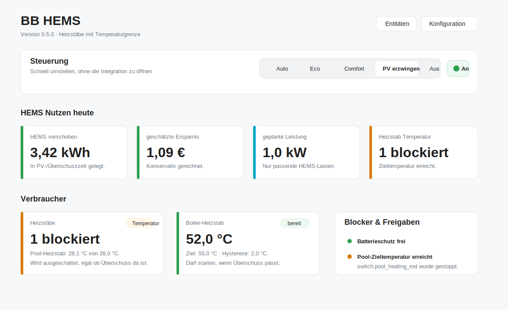
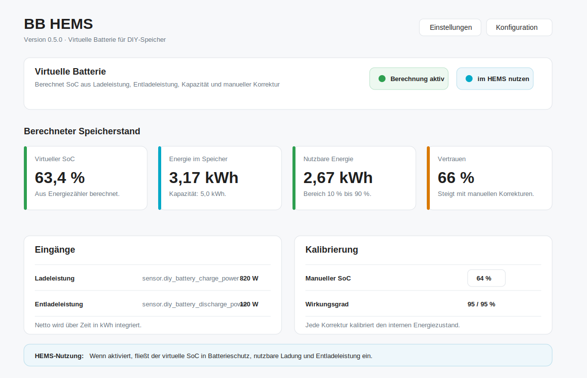

# BB HEMS

Modular Home Energy Management System for Home Assistant.

BB HEMS turns existing Home Assistant sensors and switches into one central energy decision layer. It is designed for homes with balcony power plants, PV inverters, batteries, wallboxes, heat pumps and flexible consumers such as dehumidifiers, boilers or appliances.

[BB HEMS energy dashboard mockup](docs/mockups/energy-dashboard.html)





## Goals

- Use the sensors you already have in Home Assistant.
- Aggregate multiple PV or balcony power plant sources.
- Support several batteries and use the lowest SoC for conservative protection.
- Provide one central HEMS state instead of repeating the same YAML logic per device.
- Expose settings directly as Home Assistant entities.
- Add a sidebar energy dashboard with live flow, today values, HEMS controls,
  switching history and estimated HEMS benefit.
- Prepare the model for many controllable consumers with priorities and categories.

## Current Status

This repository contains an initial custom integration scaffold:

- Config flow for selecting Home Assistant entities.
- Sensors for grid power, PV total, battery minimum SoC, battery discharge,
  grid tolerance, energy mode, planned surplus power, shifted energy today and
  estimated savings today.
- Binary sensors for surplus availability, battery protection, weather approval and flexible-load approval.
- Number entities for editable thresholds.
- Select entity for HEMS operating mode.
- Switch entity for enabling or disabling automatic HEMS decisions.
- Direct control of configured flexible loads and heating rods when the HEMS decision allows or blocks them.
- Energy-style sidebar dashboard served by the integration.
- Persistent HEMS learning values that survive Home Assistant restarts and
  group experience by season and time of day.
- Optional target temperatures for heating rods, so pool/boiler heating stops
  even when surplus is still available.
- Optional virtual battery helper for DIY batteries without a native SoC sensor.
- Optional grid import and export price sensors for more realistic HEMS savings.
- Dashboard language follows Home Assistant and can be toggled between German
  and English.
- Advanced per-device profiles with name, category, switch, power estimate,
  priority, minimum runtime, cooldown and battery usage.

The current version calculates central decisions, directly switches configured
flexible loads and heating rods, estimates the energy shifted into surplus
periods today, remembers seasonal/time-of-day HEMS experience across restarts,
can stop heating rods at configured target temperatures, can estimate a virtual
battery SoC from charge/discharge power, and shows the result in an
energy-dashboard style sidebar. Savings are estimated from the configured grid
import price minus export compensation.

## Sidebar HEMS Dashboard

The bundled `BB HEMS` sidebar panel is intended as an operational HEMS
dashboard, not as a second general energy dashboard and not as a configuration
page.

It shows:

- Home Assistant-style tiles focused on HEMS decisions and benefit.
- Quick controls for `select.bb_hems_mode` and `switch.bb_hems_auto_enabled`.
- Today's HEMS benefit: shifted energy, estimated savings, planned HEMS load and
  current seasonal HEMS experience.
- The current decision: surplus status, usable budget, next candidate and the
  relevant reason text.
- Managed consumer groups such as flexible loads, heating rods, wallboxes and
  heat pumps.
- Blockers and approvals such as battery protection, weather approval, PV
  window and surplus budget.
- HEMS switching history explaining when and why devices were allowed, blocked
  or switched.

Configuration is intentionally reduced to links from the dashboard. Detailed
setup remains in Home Assistant's integration options and entity settings.

## Feature Mockups

### Heating rod target temperature


This mockup shows how a heating rod can be treated as a normal HEMS surplus
load while still respecting a target temperature. A pool or boiler heating rod
is stopped when the configured temperature is reached, independent of current
surplus.

### Virtual battery


This mockup shows the virtual battery helper for DIY batteries without a native
SoC sensor. BB HEMS calculates SoC from charge/discharge power and lets the user
calibrate the value manually. The virtual battery can be displayed only or
explicitly enabled for HEMS decisions.

Useful real screenshots for replacing these mockups later:

- BB HEMS dashboard with at least one heating rod blocked by temperature.
- Integration options page showing heating rod switch, temperature sensor and
  target temperature.
- BB HEMS dashboard with virtual battery enabled.
- Entity list showing the virtual battery sensors, numbers and switches.

## System Model


BB HEMS is split into three layers:

1. **Sources**  
   Grid meter, PV power, balcony power plants, battery SoC, battery discharge, weather and device states.

2. **Controller**  
   Central HEMS logic calculates energy mode, surplus availability, grid tolerance, weather approval and battery protection.

3. **Consumers**  
   Flexible loads, wallboxes, heat pumps and future device categories consume the central HEMS decisions.

## Configuration Preview


The integration setup asks for entity IDs. Multiple entities can be entered comma-separated where useful.

Suggested mapping from the original automation:

| HEMS Field | Home Assistant Entity |
|---|---|
| Grid power | `sensor.power_shelly_gesamt` |
| Grid average | `sensor.grid_average_15m` |
| PV power sources | `sensor.shellyplusplugs_b0b21c105338_switch_0_power` |
| PV average | `sensor.pv_average_15m` |
| PV forecast today | `sensor.pv_forecast_today` |
| PV forecast next hour | `sensor.pv_forecast_next_hour` |
| PV forecast next 3 hours | `sensor.pv_forecast_next_3h` |
| PV arrays | `Sued=180:30:4x430, Garage Ost=90:10:2x400` |
| Battery SoC | `sensor.batterie_geschatzt_soc` |
| Battery discharge | `sensor.batterie_discharge` |
| Battery charge | `sensor.batterie_charge` |
| Grid import price | `sensor.energy_import_price` |
| Grid export price | `sensor.energy_export_price` |
| Weather state | `sensor.berlin_tempelhof_wetterzustand` |
| Cloud coverage | `sensor.berlin_tempelhof_bewolkungsgrad` |
| Sunshine duration | `sensor.berlin_tempelhof_sonnenscheindauer` |
| Sun position | `sun.sun` |
| Flexible loads | `switch.a8m` |
| Flexible load power sensors | `sensor.a8m_power` |
| Device profiles | `[{"name":"Pool","switch":"switch.pool","category":"heating_rod","power":1200,"priority":20,"min_runtime":10,"cooldown":15,"allow_battery":false}]` |
| Heating rods | `switch.boiler_heating_rod` |
| Heating rod power sensors | `sensor.boiler_heating_rod_power` |
| Heating rod temperature sensors | `sensor.pool_temperature` |
| Heating rod target temperatures | `28` |
| Virtual battery charge | `sensor.diy_battery_charge_power` |
| Virtual battery discharge | `sensor.diy_battery_discharge_power` |

## Entities

### Sensors

- `sensor.bb_hems_energy_mode`
- `sensor.bb_hems_grid_power`
- `sensor.bb_hems_grid_average`
- `sensor.bb_hems_grid_import_price`
- `sensor.bb_hems_grid_export_price`
- `sensor.bb_hems_savings_price`
- `sensor.bb_hems_pv_power_total`
- `sensor.bb_hems_pv_average`
- `sensor.bb_hems_pv_window`
- `sensor.bb_hems_pv_forecast_next_3h`
- `sensor.bb_hems_sun_elevation`
- `sensor.bb_hems_battery_soc_min`
- `sensor.bb_hems_battery_discharge_total`
- `sensor.bb_hems_battery_charge_total`
- `sensor.bb_hems_usable_battery_charge`
- `sensor.bb_hems_virtual_battery_soc`
- `sensor.bb_hems_virtual_battery_energy`
- `sensor.bb_hems_virtual_battery_usable_energy`
- `sensor.bb_hems_virtual_battery_confidence`
- `sensor.bb_hems_grid_tolerance`
- `sensor.bb_hems_cloud_coverage`
- `sensor.bb_hems_sunshine_minutes`
- `sensor.bb_hems_active_flexible_loads`
- `sensor.bb_hems_available_surplus_budget`
- `sensor.bb_hems_scheduled_surplus_power`
- `sensor.bb_hems_shifted_energy_today`
- `sensor.bb_hems_estimated_savings_today`
- `sensor.bb_hems_shifted_energy_total`
- `sensor.bb_hems_learning_samples`
- `sensor.bb_hems_seasonal_success_rate`
- `sensor.bb_hems_configured_assets`

### Binary Sensors

- `binary_sensor.bb_hems_surplus_available`
- `binary_sensor.bb_hems_battery_protect`
- `binary_sensor.bb_hems_good_weather`
- `binary_sensor.bb_hems_flexible_loads_allowed`

### Settings

- `select.bb_hems_mode`
- `switch.bb_hems_auto_enabled`
- `switch.bb_hems_battery_protection_enabled`
- `switch.bb_hems_dashboard_enabled`
- `number.bb_hems_min_battery_soc`
- `number.bb_hems_protect_battery_soc`
- `number.bb_hems_pv_threshold`
- `number.bb_hems_pv_avg_threshold`
- `number.bb_hems_grid_import_limit`
- `number.bb_hems_grid_hard_import_limit`
- `number.bb_hems_battery_discharge_limit`
- `number.bb_hems_grid_import_price`
- `number.bb_hems_grid_export_price`
- `number.bb_hems_flexible_load_power` fallback/start estimate
- `number.bb_hems_heating_rod_power` fallback/start estimate
- `number.bb_hems_heating_rod_temperature_hysteresis`
- `number.bb_hems_virtual_battery_capacity`
- `number.bb_hems_virtual_battery_min_soc`
- `number.bb_hems_virtual_battery_max_soc`
- `number.bb_hems_virtual_battery_manual_soc`
- `number.bb_hems_virtual_battery_charge_efficiency`
- `number.bb_hems_virtual_battery_discharge_efficiency`
- `select.bb_hems_response_profile`
- `switch.bb_hems_virtual_battery_enabled`
- `switch.bb_hems_use_virtual_battery`

## Operating Modes

| Mode | Behavior |
|---|---|
| `auto` | Balanced default mode. Uses PV, grid, battery and weather logic. |
| `eco` | More conservative. Avoids tolerated grid import where possible. |
| `comfort` | Allows more grid tolerance when the house should favor comfort. |
| `force_surplus` | Treats surplus as available unless battery protection blocks it. |
| `off` | Disables HEMS decisions. |

## Response Profiles

| Profile | Behavior |
|---|---|
| `auto` | Default. Near real-time where sensible: critical protection switches off immediately, normal surplus switching uses short second-level stability. |
| `realtime` | Switches on the next 10-second coordinator update without additional stability delay. |
| `seconds` | Uses short delays: 60 seconds before switching on, 30 seconds before switching off. |
| `minutes` | Conservative legacy behavior: 10 minutes before switching on, 5 minutes before switching off. |

## Decision Logic

The first controller version evaluates:

- Current grid import/export.
- Optional 15-minute grid average.
- Total PV power from all configured PV sources.
- Optional 15-minute PV average.
- Minimum battery SoC across all configured batteries.
- Total battery discharge.
- Total battery charge. From the configured minimum battery SoC and with
  suitable weather, BB HEMS can conservatively treat part of active battery
  charging as usable surplus.
- Weather state, cloud coverage and sunshine.
- PV forecast for today and PV power forecast for the next hour / next 3 hours when configured.
- Sun elevation/azimuth from `sun.sun` and configured PV arrays. Each PV surface
  can have its own name, azimuth, tilt and module size, for example
  `Sued=180:30:4x430, Garage Ost=90:10:2x400`. `180:30:800` remains valid as a
  simple 800 Wp surface.
- Configured thresholds and operating mode.

BB HEMS classifies the current PV window as `night`, `low_today`,
`weak_now`, `rising`, `good_later`, `usable_now`, `peak_now` or `falling`.
This gives dashboards and automations a stable signal for whether a better PV
window is likely later or whether the current moment is already suitable.
For multiple PV arrays, the sun-position score is calculated per configured
surface and weighted by installed module power. BB HEMS uses the currently best
matching surface instead of assuming one global roof direction.

After the central surplus decision, the smart scheduler estimates the real
surplus budget and selects only the configured loads that fit. It uses current
grid export plus the measured or estimated power of already running managed
loads, then subtracts measured battery discharge. Optional power sensors can be
assigned in the integration options in the same order as their switches. While a
load is running, BB HEMS uses that live power sensor. When a load is off or no
power sensor is configured, it falls back to `number.bb_hems_flexible_load_power`
or `number.bb_hems_heating_rod_power` as a start estimate. In the bundled
dashboard these fallback settings are hidden when matching real power sensors
are configured, but the entities remain available for custom dashboards. This
avoids switching all surplus consumers at once and also turns running loads off
when their actual power is no longer covered by real surplus.

Advanced device profiles can be configured as JSON in the load options. They
are optional and exist alongside the simple switch lists. A profile can define
`name`, `switch`, `category`, `power`, `power_sensor`, `priority`,
`min_runtime`, `cooldown`, `allow_battery`, `temperature_sensor` and
`target_temperature`. `min_runtime` and `cooldown` are minutes. Lower priority
numbers are scheduled first. If `allow_battery` is `false`, BB HEMS only plans
that device from real export/laufende Lasten and not from usable battery charge.

Heating rods can additionally use optional temperature sensors and target
temperatures. Both lists must follow the same order as the heating rod switches.
Example: two heating rods with target temperatures `55, 28` means the first
heats up to 55 °C and the second, for example a pool, up to 28 °C. When a target
is reached, BB HEMS turns that heating rod off immediately, regardless of
surplus. The hysteresis number prevents immediate restart just below the target.

BB HEMS also estimates how much energy it has shifted into surplus periods
today. The estimate integrates the planned HEMS surplus load while flexible
loads are allowed. `sensor.bb_hems_shifted_energy_today` exposes this value in
kWh. `sensor.bb_hems_estimated_savings_today` multiplies it by the configured
net benefit: grid import price minus export compensation. If no price sensors
are configured, BB HEMS uses the fallback number entities. These values are
estimates for the dashboard, not a replacement for metered utility billing.

BB HEMS now persists its own learning data in Home Assistant storage. It records
HEMS experience by season and time of day, including how often flexible loads
were allowed, the typical available budget and the estimated energy shifted in
that phase. This data survives Home Assistant restarts and is exposed through
`sensor.bb_hems_learning_samples`,
`sensor.bb_hems_seasonal_success_rate` and attributes on
`sensor.bb_hems_energy_mode`. The dashboard uses this to show whether the
current season/time window has historically been useful for HEMS decisions.
The learning layer is intentionally conservative. After enough samples in the
current season/time window, it may slightly relax or tighten the grid tolerance
for `auto` and `comfort`. Hard protection rules such as battery protection,
`eco`, `force_surplus`, `off` and real surplus checks still take priority.

If battery charge sensors are configured, BB HEMS can also use active battery
charging as a smart surplus signal. This is intentionally conservative: the
lowest battery SoC must be at least the configured minimum battery SoC, weather
must be approved and BB HEMS keeps a small charging reserve before flexible
loads are planned.

For DIY batteries without a native SoC sensor, BB HEMS can calculate a virtual
SoC from a charge power sensor, a discharge power sensor and the configured
capacity. The user can correct `number.bb_hems_virtual_battery_manual_soc` from
time to time; BB HEMS then recalibrates the internal energy value and raises the
confidence value as more corrections are made. Min/max SoC define the usable
range, for example 10% to 90%. The virtual battery is only used for HEMS
decisions when both `switch.bb_hems_virtual_battery_enabled` and
`switch.bb_hems_use_virtual_battery` are on.

The main output is still exposed for dashboards and optional automations:

```yaml
binary_sensor.bb_hems_flexible_loads_allowed
```

Configured flexible loads and heating rods are switched by the integration itself:

- In `auto`, critical protection cases switch off immediately; normal switching uses short second-level stability.
- In `realtime`, the next 10-second coordinator update can switch devices.
- In `seconds`, configured surplus loads switch on after 60 seconds and off after 30 seconds.
- In `minutes`, configured surplus loads switch on after 10 minutes and off after 5 minutes.
- When `switch.bb_hems_auto_enabled` is off, BB HEMS does not switch devices automatically.

`switch.bb_hems_battery_protection_enabled` can disable the battery protection
layer. When disabled, SoC, minimum SoC and battery discharge protection no
longer block HEMS decisions. Surplus, weather, scheduler and hard grid logic
still apply.

To avoid using the battery for surplus consumers, set
`number.bb_hems_battery_discharge_limit` to `0`. Any positive configured battery
discharge then activates battery protection and switches planned surplus loads
off. Higher values intentionally tolerate that many watts of battery discharge.

## Installation

Copy this folder into Home Assistant:

```text
custom_components/bb_hems
```

Restart Home Assistant, then add the integration:

```text
Settings -> Devices & services -> Add integration -> BB HEMS
```

After setup, a `BB HEMS` entry appears in the Home Assistant sidebar. The
sidebar opens the energy dashboard and provides quick links to configuration,
entities and devices. The sidebar dashboard can be hidden with
`switch.bb_hems_dashboard_enabled`. All HEMS functions remain available as
normal Home Assistant entities for users who prefer building their own
dashboards.

## Support

Home Health Overview ist kostenlos und bleibt kostenlos.

Home Health Overview is free and will remain free.

[Buy me a coffee](https://buymeacoffee.com/sebasbe)
